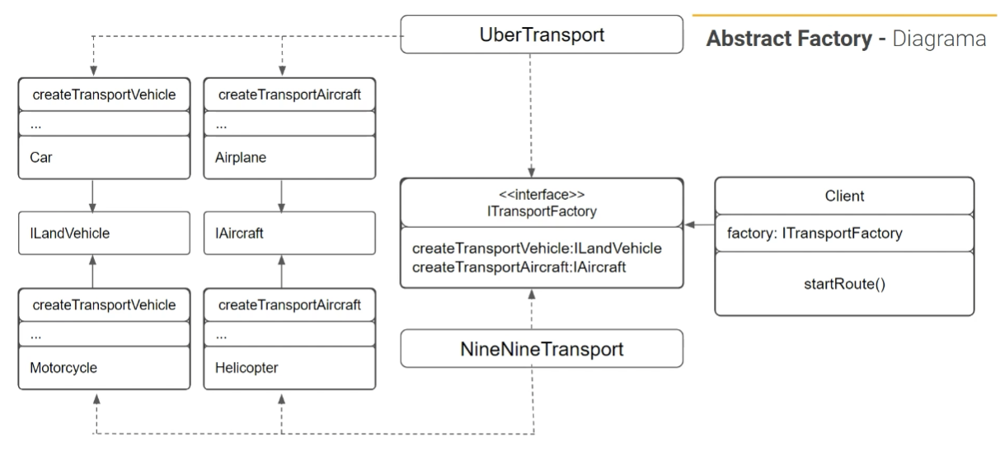

# Abstract Factory

## Cenário

- Uber/99

## O problema

A nossa aplicação está sendo um sucesso, mas agora temos uma nova demanda.

Criamos um marketplace de transportes, e não somente Uber, mas a 99 e outros parceiros podem estar conosco, agora, além de termos diferentes tipos de transportes, podemos ter diferentes tipos de empresas prestando o mesmo serviço, e nossa aplicação precisa prever quais tipos de transportes estão disponíveis para cada empresa. Como são os mesmos tipos de serviços podemos utilizar o Abstract Factory.

## A Solução

No Abstract Factory primeiro precisamos declarar explicitamente interfaces para cada produto distinto da família de produtos (ex: veículos e aeronaves). Então podemos fazer todas as variantes dos produtos seguirem essas interfaces.

Em seguida declaramos a fábrica abstrata - uma interface com uma lsta de métodos de criação para todos os produtos que fazem parte da família de produtos (por exemplo, **createVehicleTransport**, **createAircraftTransport**). Esses métodos devem retornar tipos abstratos de produtos representados pelas interfaces que extraímos previamente: **Vehicle**, **Aircraft** e assim por diante.

E como fazer para as variantes Uber, 99 ou outros? Para cada variante de uma família de produtos nós criamos uma classe fábrica separada baseada na interface **TransportAbstractFactory**. Uma fábrica é uma classe que retorna produtos de um tipo de particular. Por exemplo, a classe **UberTransport** só pode criar objetos **Car** e **Airplane**, já a classe **NineNineTransport** só cria **Motorcycle** e **Helicopter**.

O código cliente tem que funcionar com ambas as fábricas e produtos via suas respectivas interfaces abstratas. Isso permite que você mude o tipo de uma fábrica que passou para o código cliente, sem quebrar o código cliente atual.

## Diagrama

